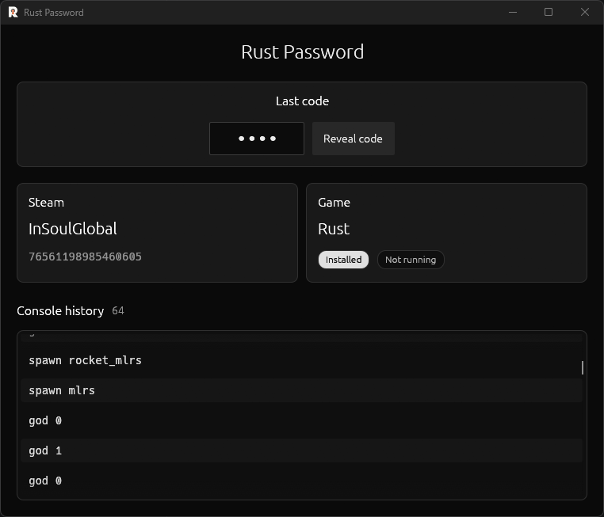

# Rust Password

Rust Password is a small Windows app that shows information saved locally by Rust and Steam.
Use it to quickly recover your last entered server code, review recent console commands, and
check which Steam account is active.



## What it shows

- Last server code, hidden until you choose **Reveal code**
- Console history with the newest commands first
- Active Steam name and SteamID64
- Whether Rust is installed or currently running

## Privacy

Rust Password reads only the current Windows user's local registry. It does not modify registry
values, connect to a server, or send your data anywhere.

## Requirements

- Windows 10 or 11
- Rust and Steam data already present for the current Windows user

## Run from source

Install [Rust](https://www.rust-lang.org/tools/install), clone this repository, then run:

```powershell
cargo run --release
```

The optimized executable is created at `target/release/rust-password.exe`.

## Command line

To print the same scan results without opening the interface:

```powershell
cargo run --example scan
```

## Development

```powershell
cargo fmt --all --check
cargo test --all-targets
cargo clippy --all-targets -- -D warnings
```
